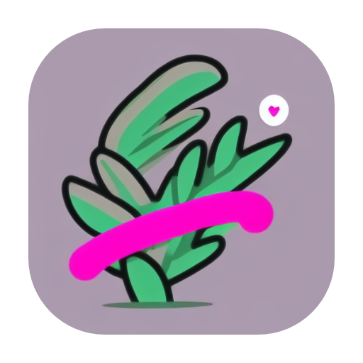
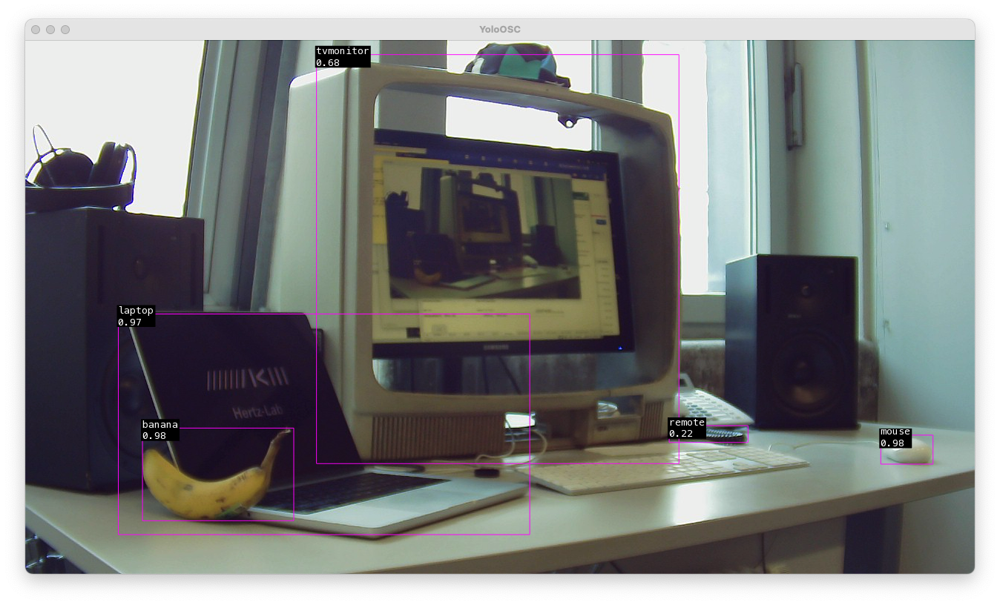

YoloOSC
=======



Yolo live object identification to OSC.
 
This code base has been developed by [ZKM | Hertz-Lab](https://zkm.de/en/about-the-zkm/organization/hertz-lab) as part of the project [»The Intelligent Museum«](#the-intelligent-museum).

Copyright (c) 2022 ZKM | Karlsruhe.  
Copyright (c) 2022 Dan Wilcox.

GNU GPL Version 3.

ofxYolo.h from [ofxTensorFlow2](https://github.com/zkmkarlsruhe/ofxTensorFlow2) example_style_transfer_arbitrary under a
BSD Simplified License: https://github.com/zkmkarlsruhe/ofxTensorFlow2  
[Jonathhhan](https://github.com/Jonathhhan) & members of the ZKM | Hertz-Lab 2022

Yolo v4 model by https://github.com/AlexeyAB/darknet  
TFlite version from https://github.com/hunglc007/tensorflow-yolov4-tflite

Dependencies
------------

* [openFrameworks](https://openframeworks.cc/download/)
* openFrameworks addons:
  - ofxOSC (included with oF)
  - [ofxTensorFlow2](https://github.com/zkmkarlsruhe/ofxTensorFlow2)
  - [ofxSyphon](https://github.com/astellato/ofxSyphon) (macOS)
* [CLI11 parser](https://github.com/CLIUtils/CLI11) (included in `src`)
* pre-trained YOLO model and COCO classes txt file (download separately)

Structure
---------

* `src/`: contains the openFrameworks C++ code
* `bin/data/model`: contains the SavedModels trained with TensorFlow2
* `bin/data/classes.txt`: COCO identification class strings, one per line

Installation & Build
--------------------

Overview:

1. Download the required TF2 model and COCO classes file
2. Follow the steps in the ofxTensorFlow2 "Installation & Build" section for you platform
3. Generate the project files for this folder using the OF ProjectGenerator
4. Build for your platform

### Download Pre-Trained Model

A pre-trained Yolo model can be downloaded as a `model_yolo_v4.zip` file from the public shared link here:

<https://cloud.zkm.de/index.php/s/gfWEjyEr9X4gyY6>

Unzip the file and place the `model` directory and `classes.txt` file into the YoloOSC `bin/data` directory.

To make this quick, a script is provided to download and install the model (requires a Unix shell, curl, and unzip):

```shell
./scripts/download_model.sh
```

### Generating Project Files

Project files are not included so you will need to generate the project files for your operating system and development environment using the OF ProjectGenerator which is included with the openFrameworks distribution.

To (re)generate project files for an existing project:

1. Click the "Import" button in the ProjectGenerator
2. Navigate to the project's parent folder ie. "apps/myApps", select the base folder for the example project ie. "YoloOSC", and click the Open button
3. Click the "Update" button

If everything went Ok, you should now be able to open the generated project and build/run the example.

_Note: Some platforms require additional steps before / after project file generation. See following sections._

### macOS

On macOS, a couple of additional manual steps are required to use ofxTensorflow2:

1. Enable C++14 (minimum) or C++17 in openFrameworks (only once, Xcode + Makefile). See the detailed steps in the [ofxTensorflow2 readme](https://github.com/zkmkarlsruhe/ofxTensorFlow2#macos).
2. Generate YoloOSC project files with the ProjectGenerator
3. Close the YoloOSC project in Xcode if it's open, then run `configure_xcode.sh` to configure the Xcode project (after every project regeneration, Xcode only)\*:
```shell
scripts/configure_xcode.sh .
```

\*_Note: the `.` is important, it means "this directory."_

For an Xcode build, open the Xcode project, select the "YoloOSC Debug" scheme, and hit "Run".

For a Makefile build, build and run on the terminal:

```shell
make ReleaseYolo
make RunRelease
```

### Linux

An additional step is required *before* generating the project files:

1. Run `configure_makefile.sh` to configure the project (only needed once)\*:
```shell
scripts/configure_makefile.sh .
```
2. Generate YoloOSC project files with the ProjectGenerator

\*_Note: the `.` is important, it means "this directory."_

Next, build and run on the terminal:

```shell
make Release
make RunReleaseTF2
```

Usage
-----



The openFrameworks application runs the Yolo v4 object detection model using live camera input. The detected objects are sent out using OSC (Open Sound Control) messages.

### Key Commands

* `m`: toggle horz mirroring
* `n`: toggle vert mirroring

### OSC Communication

#### Sending

By default, sends to:
* address: `localhost` ie. `127.0.0.1`
* port: `7765`

Message specification:

* **/begin _num_**: detection frame begin
  - num: int, number of objects detected
* **/object _id_ _identindex_ _identtext_ _x_ _y_ _w_ _h_ _confidence_**: detected object
  - id: int, object id, 0 to n-1
  - identindex: int, identified object class index, 0 to n-1\*
  - identtext: string, identified object class string, ie. "dog", "cat", "car", ...
  - x, y, w, & h: float, normalized bounding box 0-1 (top left corner)
  - confidence: float, detection confidence %, 0-1
* **/end**: detection frame end

\* The max number of classes is taken from the number of lines in `bin/data/classes.txt` where each line contains one identified class string.

#### Commandline Options

Additional run time settings are available via commandline options as shown via the `--help` flag output:

~~~
% bin/YoloOSC --help
yolo live object identification to osc
Usage: YoloOSC [OPTIONS]

Positionals:
  XML TEXT                    XML settings file

Options:
  -h,--help                   Print this help message and exit
  -a,--address TEXT           OSC send host address or name, default localhost
  -p,--port INT               OSC send port, default 7765
  -l,--list                   list input devices and exit
  -d,--dev INT                input device number, default 0
  -r,--rate INT               desired input framerate, default 30
  -s,--size TEXT              desired input size, default 640x480
  -m,--mirror                 mirror horizontally
  -f,--flip                   flip vertically
  --syphon                    start streaming with Syphon (macOS only)
  -v,--verbose                verbose printing
  --version                   print version and exit

~~~

For example, to send OSC to a different address and port, use the `-a` and `-p` options:

~~~
bin/YoloOSC -a 192.168.0.101 -p 7777
~~~

#### macOS

For macOS, the application binary can be invoked from within the .app bundle to pass commandline arguments:

~~~
bin/YoloOSC.app/Contents/MacOS/YoloOSC -h
~~~

or via the system `open` command:

~~~
open bin/YoloOSC.app --device 1
~~~

_Note: `open` will launch the app without a Terminal window, so console output cannot be read._

This approach can also be wrapped up into a shell alias to be added to the account's `~/.bash_profile` or `~/.zshrc` file:

~~~
alias yoloosc="/Applications/YoloOSC.app/Contents/MacOS/YoloOSC"
~~~

Reload the shell and application can now be invoked via:

~~~
yoloosc -v --device 1
~~~

Another option is to use a wrapper script, such as the `yoloosc.sh` script included with this repo:

~~~
./yoloosc.sh -v --device 1
~~~

_Note: The `yoloosc.sh` script uses the release build "YoloOSC" .app naming. If you are testing with the debug build, edit the `APP` variable name to "YoloOSCDebug"._

#### XML Settings

In addition to the commandline options, YoloOSC can also load settings from an XML file.

By default, a file named "settings.xml" located in `bin/data` will be loaded at startup. Also, a file path can be given to YoloOSC as the first non-option argument, ex:

~~~
bin/YoloOSC path/to/mysettings.xml
~~~

_Note: Settings are loaded from the XML file *first*, then any commandline options are applied *second* as overrides._

A template XML file is found in `doc/settings.xml`. The format follows the commandline options naming:

* settings: root tag
* child tags:
  - address: string, osc send address
  - port: int, osc send port
  - dev: int, input device number
  - rate: int, desired input framerate
  - size:
    + width: int, desired input size width
    + height: int, desired input size height
  - mirror: bool (0 or 1), mirror horizontally
  - flip: bool (0 or 1), flip vertically
  - syphon: bool (0 or 1), start streaming with Syphon (macOS only)

#### Syphon (macOS)

On macOS, the camera input frames can be received by client applications which use [Syphon](http://syphon.v002.info):

>Syphon is an open source Mac OS X technology that allows applications to share frames - full frame rate video or stills - with one another in realtime.

Syphon streaming is off by default, use the commandline `--syphon` flag to enable (see Commandline Options macOS section):

~~~
open bin/YoloOSC.app --args --syphon
~~~

When streaming, YoloOSC publishes the camera frame using the following naming format:
* server name: "frame"
* app name: "YoloOSC" (Release) or "YoloOSCDebug" (Debug)

For example, if receiving from YoloOSC (Release) in another openFrameworks application using a ofxSyphon client:

```c++
// ofApp.h
ofxSyphonClient client;

// ofApp.cpp
void ofApp::setup() {
    ...
    client.setup();
    client.set("frame", "YoloOSC");
}

void ofApp::draw() {
    ofSetColor(255);
    client.draw(0, 0);
}
```

To disable building with Syphon support, remove the "ofxSyphon" line from `addons.make`, (re)generate the project files, and build.

For a makefile build, use the `ReleaseTF2` or `DebugTF2` targets instead of the `ReleaseYolo` or `DebugYolo` targets to install the libtensorflow2 libs *without* installing the Syphon framework:

```shell
make ReleaseTF2
make RunRelease
```

Develop
-------

### Release steps

1. Update changelog
2. Update app version in src/config.h define and openFrameworks-Info.plist
3. Tag version commit, ala "0.3.0"
4. Push commit and tags to server:
~~~
git commit push
git commit push --tags
~~~

### macOS build distribution

1. Set Signing & Capabilities Team
2. Enable Hardened Runtime
3. Notarize app
4. Bundle app and data into YoloOSC-version distribution folder
5. Compress distribution folder into YoloOSC-version.dmg disk image
6. Sign disk image

Known Issues
------------

### Xcode Legacy Build System error

If the build fails in Xcode 12 or 13 with a "The Legacy Build System will be removed in a future release." error, disable this warning via:
1. Open File->Project Settings
2. Check "Do not show a diagnostic issue about build system deprecation"
3. Click "Done"

_This is likely to be fixed via OF version 0.12._

### Xcode Release build errors due to missing _TF_ functions

When building for Debug, only the architecture of the system is built. When building for Release, multiple architectures will be targeted (Intel and Arm), however since libtensorflow builds are currently single arch only, the Release build will fail to link due to missing architectures.

The quick fix is to disable building for the non-system architecture, for example on an M1 system (arm64) we disable building for Intel (x86_64) and vice-versa in the Xcode project:

1. Click on the project in the top left of the project tree
2. Click on the project Target, then the Build Settings tab, make sure "All" is selected
3. Double-click on Excluded Architectures, and enter the non-system arch, ie. "x86_64" for an M1 "arm64" system, etc.

Now a Release rebuild should hopefully finish.

The Intelligent Museum
----------------------

An artistic-curatorial field of experimentation for deep learning and visitor participation

The [ZKM | Center for Art and Media](https://zkm.de/en) and the [Deutsches Museum Nuremberg](https://www.deutsches-museum.de/en/nuernberg/information/) cooperate with the goal of implementing an AI-supported exhibition. Together with researchers and international artists, new AI-based works of art will be realized during the next four years (2020-2023).  They will be embedded in the AI-supported exhibition in both houses. The Project „The Intelligent Museum” is funded by the Digital Culture Programme of the [Kulturstiftung des Bundes](https://www.kulturstiftung-des-bundes.de/en) (German Federal Cultural Foundation) and funded by the [Beauftragte der Bundesregierung für Kultur und Medien](https://www.bundesregierung.de/breg-de/bundesregierung/staatsministerin-fuer-kultur-und-medien) (Federal Government Commissioner for Culture and the Media).

As part of the project, digital curating will be critically examined using various approaches of digital art. Experimenting with new digital aesthetics and forms of expression enables new museum experiences and thus new ways of museum communication and visitor participation. The museum is transformed to a place of experience and critical exchange.


